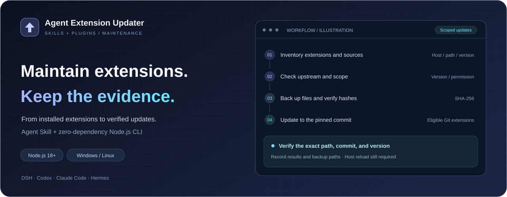
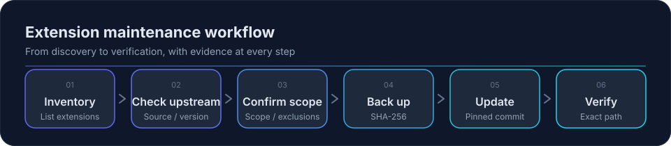

<p align="center"></p>
<h1 align="center">Agent Extension Updater</h1>
<p align="center"><strong>Maintain extensions. Keep the evidence.</strong></p>
<p align="center">A unified maintenance workflow for AI agent skills and plugins</p>
<p align="center"><a href="README.md">简体中文</a> · <strong>English</strong></p>
<p align="center">
  <a href="https://github.com/Curlance/agent-extension-updater/actions/workflows/ci.yml"></a>
  
  
  <a href="LICENSE"></a>
</p>
<p align="center">
  <a href="#quick-start">Quick start</a> · <a href="#current-support">Support</a> ·
  <a href="#install-as-an-agent-skill">Install Skill</a> · <a href="#backup-and-recovery">Recovery</a> ·
  <a href="docs/DESIGN.md">Design notes</a>
</p>

<picture>
  <source media='(max-width: 600px)' srcset='assets/banner.mobile.en.svg'>
  
</picture>

An **Agent Skill** plus a standalone **Node.js CLI**. Let your agent follow the maintenance workflow, or run the scripts directly to inspect extension status.

> **Check before applying.** Automatic updates are disabled by default; enabling them does not bypass eligibility checks. Success means files are updated and awaiting host reload. Runtime loading and compatibility still need verification.

## What it does

- **See the installation situation clearly**: lists each extension's host, name, path, channel, current version, and check result.
- **Distinguish update states**: reports updates available, up to date, check failed, no source, and pending adaptation separately.
- **Update eligible Git extensions**: pins the remote, tracking branch, and target commit, and re-checks before execution.
- **Preserve the basis for recovery**: fully backs up the skill or plugin directory and verifies file hashes, and supports restoring to a new directory.
- **Leave an operation record**: records update targets, backup locations, and verification results for later tracing.

This project maintains skills and plugins only. It does not manage the agent client itself, standalone MCP services, models, or the operating system.

## Maintenance workflow



A failed check stops the entire run. An execution or verification failure stops remaining updates and returns a nonzero exit code. See [backup and recovery](#backup-and-recovery).

## Current support

The skill documentation provides multi-host maintenance guidance; the capabilities the scripts already implement are listed below. **Being able to discover an extension does not mean automatic updates are already supported for that channel.**

| Host or channel | Inventory and checks | Automatic execution |
| --- | --- | --- |
| DeepSeek Harness (DSH) | User-level and project-level skills; profile plugin dependencies; actual installed npm version and upstream version | Eligible standalone Git skills and local Git plugins |
| Codex | User-level and project-level `.agents/skills`; detects a skill's Git source | Eligible standalone Git skills |
| Claude Code | User-level and project-level skills; detects a skill's Git source | Eligible standalone Git skills |
| Hermes | Distinguishes Hub, bundled, and local skills; enumerates plugin directories | Eligible standalone local Git skills; Hub and plugin protocols await adaptation |
| Other hosts | General maintenance guidance; no dedicated scanner yet | Requires adaptation to the actual installation method |

Plugin installation records and update protocols for Codex and Claude Code do not have adapters yet, and the scripts say so explicitly. DSH npm plugins are version-checked only; updating them is left to manual handling after exiting the host.

### Which projects can be updated automatically

The automatic-update switch is off by default. Once enabled, an item must still satisfy all of the following conditions at the same time:

1. It belongs to an authorized host and type and is not excluded.
2. The extension directory is itself the root of a standalone Git repository, with no local modifications in the working tree.
3. The current version can be read; the target commit has a unique semantic-version tag, and the version declared in the contents matches that tag.
4. It does not involve a major-version upgrade, a version downgrade, or a prerelease target.
5. The backup passes verification; the remote, branch, and target are unchanged; the update can complete as a fast-forward.

Subdirectories of shared repositories, Git worktrees, symbolic links/junctions, and unknown versions are left for manual handling. A version-number check is not a substitute for a compatibility assessment.

## Quick start

### Requirements

- **Node.js 18+**: the scripts use built-in modules only; no `npm install` is needed.
- **Git**: used to detect Git sources, check commits, and perform Git updates.
- **npm**: needed when checking upstream versions of npm plugins.

Run the following commands from the project root.

### 1. Inventory and check first

```bash
# 本地盘点，不查询网络
node skills/agent-extension-updater/scripts/inventory.mjs --all

# 只检查 Codex 技能的上游状态
node skills/agent-extension-updater/scripts/inventory.mjs --hosts codex --check-updates

# 指定项目目录，并输出 JSON
node skills/agent-extension-updater/scripts/inventory.mjs --hosts codex --project "./your-project" --json
```

Without `--hosts`, all implemented hosts are scanned; `dsh`, `hermes`, `codex`, and `claude` are supported, and multiple values are separated by commas. `--json` changes only the output format; network checks still require `--check-updates`.

### 2. Set the scope and rehearse

```bash
# 查看开关，默认关闭
node skills/agent-extension-updater/scripts/auto-update.mjs --status

# 保存自动更新范围并启用开关；此命令本身不更新扩展
node skills/agent-extension-updater/scripts/auto-update.mjs --enable --hosts codex

# 查看本轮会做什么，不执行更新
node skills/agent-extension-updater/scripts/auto-update.mjs --run --dry-run
```

`--hosts` is used with `--enable` to save the scope; actual runs and rehearsals read the scope from the configuration. A shared skill directory requires every identified consuming host to be within the authorized scope, for example a directory used by both DSH and Codex.

A rehearsal queries upstream sources and writes no extensions, backups, locks, or audit logs for this tool; npm queries may update npm's own cache. A rehearsal can also run while the switch is off.

### 3. Apply and review the results

```bash
# 按已保存范围实际执行
node skills/agent-extension-updater/scripts/auto-update.mjs --run

# 查看最近的审计记录
node skills/agent-extension-updater/scripts/auto-update.mjs --report

# 关闭自动更新授权
node skills/agent-extension-updater/scripts/auto-update.mjs --disable
```

Enabling the switch neither creates a scheduled task nor starts a background service. Every update requires running `--run`, or a call from a scheduler you configure. For project-level skills, you can specify the project directory with `--run --project "./your-project"`.

## Install as an Agent Skill

Copy the entire [`skills/agent-extension-updater/`](skills/agent-extension-updater/) directory into the host's skill directory, keeping `SKILL.md`, `references/`, `templates/`, and `scripts/`, including the shared `lib.mjs` module.

| Host | User-level installation location |
| --- | --- |
| DeepSeek Harness | `$DSH_HOME/skills/agent-extension-updater/`, under `~/.dsh/skills/` by default |
| Hermes | `$HERMES_HOME/skills/<category>/agent-extension-updater/` |
| Codex | `~/.agents/skills/agent-extension-updater/` |
| Claude Code | `~/.claude/skills/agent-extension-updater/` |

The installation directory and reload method are governed by the host's actual configuration; start a new session or reload skills when needed. Once installed, the skill needs local file access and command execution capabilities to maintain extensions on this machine.

You can then ask in natural language:

> Use agent-extension-updater to check only the skills and plugins of the current host, and list update sources, target versions, and items that need manual handling.

Or:

> Review the last update record and tell me which files were updated and which still need to be reloaded.

## Backup and recovery

The default configuration file is `~/.agent-extension-updater/config.json`. Setting the `AGENT_EXTENSION_UPDATER_CONFIG` environment variable changes the location; backups, logs, and lock files are stored with the configuration in the same parent directory.

```text
.agent-extension-updater/
├── config.json
├── auto-update.log.jsonl
├── run.lock                  # 实际运行期间的排他锁
└── backups/
    └── <运行标识>/<扩展身份>/
        ├── files/            # 完整目录副本
        └── record.json       # 原路径、提交及文件哈希
```

Restore a backup to a new directory that does not exist yet:

```bash
node skills/agent-extension-updater/scripts/auto-update.mjs --restore "./path/to/record.json" --to "./recovered-extension"
```

File hashes are verified both before and after restoration. The command does not overwrite the current installation; after reviewing the restored contents, reconnect it to the installation location as the host requires.

The update workflow follows these rules:

- If any item or directory-scan check fails, the entire run of updates stops and returns a nonzero exit code.
- If a backup fails or the pre-update audit record cannot be written, that item's update is not performed.
- After an update, the commit, version, and skill name are re-checked by exact path, and success is recorded only if that passes; a failed execution or verification stops the remaining updates in the run.
- The success state is **“已落盘待重载”** (“written to disk, reload pending”), which does not mean the host has already loaded it, nor that the extension's behavior is compatible.
- The lock file only coordinates processes that use the same configuration directory; a leftover lock after an abnormal process exit requires manual verification before it is handled.

See the [automatic-update specification](skills/agent-extension-updater/references/auto-update.md) for the complete rules.

## Development and tests

```bash
# 技能结构、frontmatter 和文档链接检查
node skills/agent-extension-updater/scripts/check-skill.mjs skills/agent-extension-updater

# 隔离回归测试
node --test tests/updater.test.mjs
```

Tests use temporary directories and local Git repositories and cover the full update and recovery flow, branch and remote changes, version misjudgement, local modifications, backup failures, verification failures, and audit faults, with no need to connect to a real host or access the network.

CI is configured with a Windows/Linux and Node.js 18/22 matrix. Local Git tests are not a substitute for upgrade and runtime acceptance in a real host.

## Project layout and documentation

```text
skills/agent-extension-updater/
├── SKILL.md
├── README.md
├── references/              # 宿主说明与自动更新规则
├── templates/               # 确认与结果报告模板
└── scripts/
    ├── inventory.mjs        # 盘点与上游检查
    ├── auto-update.mjs      # 开关、执行、审计与恢复入口
    ├── lib.mjs              # 版本、Git、备份与验证
    └── check-skill.mjs      # 技能结构检查
tests/updater.test.mjs
assets/                    # 徽标与流程图
docs/DESIGN.md
README.md
README.en.md
CHANGELOG.md
LICENSE
```

- [Skill entry point](skills/agent-extension-updater/SKILL.md)
- [Design notes](docs/DESIGN.md)
- [Changelog](CHANGELOG.md)

## License

Released under the [PolyForm Noncommercial 1.0.0](LICENSE) license: **noncommercial use only**.

- **Permitted**: personal study, research, experimentation, private entertainment, and hobbies; use by educational institutions, charitable organizations, public research institutions, public health and safety institutions, environmental organizations, and government institutions, regardless of their funding source.
- **Forbidden**: any commercial use, including internal business use; commercial use requires separate authorization.
- **Distribution obligation**: when passing it on to others, you must include the full license text (or the [original link](https://polyformproject.org/licenses/noncommercial/1.0.0)) together with the notice line below.

Required Notice: Copyright Curlance (https://github.com/Curlance)
