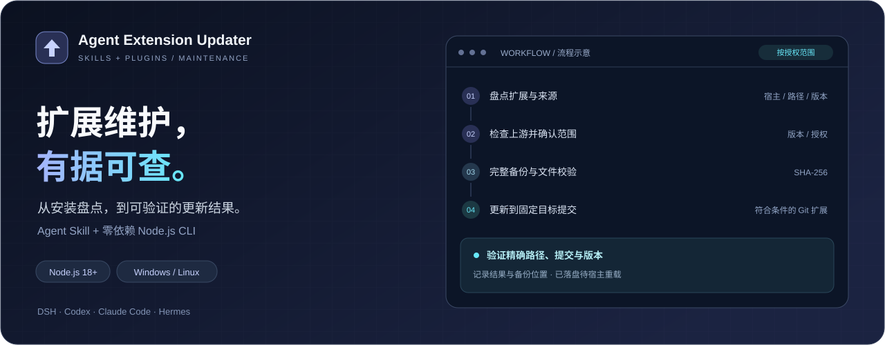
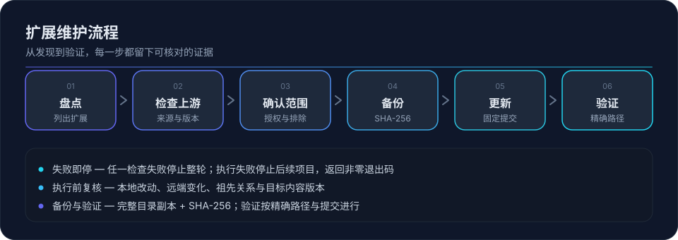

<p align="center"></p>
<h1 align="center">Agent Extension Updater</h1>
<p align="center"><strong>扩展维护，有据可查。</strong></p>
<p align="center">为 AI Agent 的 skills 与 plugins 提供统一维护流程</p>
<p align="center"><strong>简体中文</strong> · <a href="README.en.md">English</a></p>
<p align="center">
  <a href="https://github.com/Curlance/agent-extension-updater/actions/workflows/ci.yml"></a>
  
  
  <a href="LICENSE"></a>
</p>
<p align="center">
  <a href="#快速开始">快速开始</a> · <a href="#当前支持范围">支持范围</a> ·
  <a href="#作为-agent-skill-安装">安装 Skill</a> · <a href="#备份与恢复">备份与恢复</a> ·
  <a href="docs/DESIGN.md">设计说明</a>
</p>

<picture>
  <source media='(max-width: 600px)' srcset='assets/banner.mobile.svg'>
  
</picture>

一份可由 Agent 加载的 **Skill**，加上一套可独立运行的 **Node.js 命令行工具**。让 Agent 按流程协助维护，或直接运行脚本检查扩展状态。

> **先检查，再执行。** 自动更新默认关闭；启用后仍须满足全部更新条件。成功状态为“已落盘待重载”，宿主加载与行为兼容需另行确认。

## 能做什么

- **看清安装情况**：列出扩展的宿主、名称、路径、渠道、当前版本及检查结果。
- **区分更新状态**：分别报告有更新、已最新、检查失败、无来源和待适配。
- **更新符合条件的 Git 扩展**：固定远端、跟踪分支和目标提交，执行前重新检查。
- **保留恢复依据**：完整备份技能或插件目录并校验文件哈希，支持恢复到新目录。
- **留下操作记录**：记录更新目标、备份位置和验证结果，便于追溯。

本项目只维护技能与插件，不管理 Agent 客户端本身、独立 MCP 服务、模型或操作系统。

## 维护流程



检查失败会停止整轮；执行或验证失败会停止后续更新并返回非零退出码。详见 [备份与恢复](#备份与恢复)。

## 当前支持范围

技能文档提供多宿主维护指引；脚本已经实现的能力如下。**能够发现扩展，不代表已经支持自动更新该渠道。**

| 宿主或渠道 | 盘点与检查 | 自动执行 |
| --- | --- | --- |
| DeepSeek Harness（DSH） | 用户级、项目级技能；profile 插件依赖；npm 实际安装版本与上游版本 | 符合条件的独立 Git 技能及本地 Git 插件 |
| Codex | 用户级与项目级 `.agents/skills`；识别技能的 Git 来源 | 符合条件的独立 Git 技能 |
| Claude Code | 用户级与项目级技能；识别技能的 Git 来源 | 符合条件的独立 Git 技能 |
| Hermes | 区分 Hub、内置和本地技能；枚举插件目录 | 符合条件的独立 Git 本地技能；Hub 与插件协议待适配 |
| 其他宿主 | 提供通用维护指引，尚无专用扫描器 | 需按实际安装方式适配 |

Codex 和 Claude Code 的插件安装记录与更新协议尚未适配，脚本会明确提示。DSH 的 npm 插件只检查版本，更新留待退出宿主后人工处理。

### 哪些项目可以自动更新

自动更新开关默认关闭。启用后，条目仍须同时满足以下条件：

1. 属于授权宿主与类型，且未被排除。
2. 扩展目录就是独立 Git 仓库根目录，工作区没有本地修改。
3. 当前版本可以读取；目标提交有唯一的语义版本标签，且内容声明的版本与标签一致。
4. 不涉及主版本升级、版本降级或预发布目标。
5. 备份校验通过；远端、分支及目标未变化；更新可以快进完成。

共享仓库中的子目录、Git worktree、符号链接/junction 和未知版本会留待人工处理。版本号检查不能替代兼容性评估。

## 快速开始

### 环境要求

- **Node.js 18+**：脚本仅使用内置模块，无需 `npm install`。
- **Git**：用于识别 Git 来源、检查提交及执行 Git 更新。
- **npm**：检查 npm 插件的上游版本时需要。

以下命令均在项目根目录执行。

### 1. 先盘点和检查

```bash
# 本地盘点，不查询网络
node skills/agent-extension-updater/scripts/inventory.mjs --all

# 只检查 Codex 技能的上游状态
node skills/agent-extension-updater/scripts/inventory.mjs --hosts codex --check-updates

# 指定项目目录，并输出 JSON
node skills/agent-extension-updater/scripts/inventory.mjs --hosts codex --project "./your-project" --json
```

不传 `--hosts` 时扫描所有已实现的宿主；支持 `dsh`、`hermes`、`codex`、`claude`，多个值以逗号分隔。`--json` 只改变输出格式，联网检查仍需添加 `--check-updates`。

### 2. 设置范围并演练

```bash
# 查看开关，默认关闭
node skills/agent-extension-updater/scripts/auto-update.mjs --status

# 保存自动更新范围并启用开关；此命令本身不更新扩展
node skills/agent-extension-updater/scripts/auto-update.mjs --enable --hosts codex

# 查看本轮会做什么，不执行更新
node skills/agent-extension-updater/scripts/auto-update.mjs --run --dry-run
```

`--hosts` 用于 `--enable` 保存范围；实际运行和演练从配置读取范围。共享技能目录要求所有已识别的使用宿主都在授权范围内，例如同时供 DSH 和 Codex 使用的目录。

演练会查询上游，不写扩展、备份、锁或本工具的审计日志；npm 查询可能更新 npm 自身的缓存。演练也可以在开关关闭时运行。

### 3. 执行并查看结果

```bash
# 按已保存范围实际执行
node skills/agent-extension-updater/scripts/auto-update.mjs --run

# 查看最近的审计记录
node skills/agent-extension-updater/scripts/auto-update.mjs --report

# 关闭自动更新授权
node skills/agent-extension-updater/scripts/auto-update.mjs --disable
```

启用开关不会创建定时任务，也不会启动后台服务。每次更新都需要运行 `--run`，或由你配置的调度器调用。项目级技能可以通过 `--run --project "./your-project"` 指定项目目录。

## 作为 Agent Skill 安装

将整个 [`skills/agent-extension-updater/`](skills/agent-extension-updater/) 目录复制到宿主的技能目录，保留 `SKILL.md`、`references/`、`templates/` 和 `scripts/`，包括共享模块 `lib.mjs`。

| 宿主 | 用户级安装位置 |
| --- | --- |
| DeepSeek Harness | `$DSH_HOME/skills/agent-extension-updater/`，默认位于 `~/.dsh/skills/` 下 |
| Hermes | `$HERMES_HOME/skills/<分类>/agent-extension-updater/` |
| Codex | `~/.agents/skills/agent-extension-updater/` |
| Claude Code | `~/.claude/skills/agent-extension-updater/` |

安装目录和重新加载方式以宿主实际配置为准；需要时开启新会话或重载技能。安装后的技能需要本地文件和命令执行能力，才能维护本机扩展。

随后可以用自然语言请求：

> 使用 agent-extension-updater，只检查当前宿主的技能和插件，列出更新来源、目标版本和需要人工处理的项目。

或：

> 查看上次更新记录，告诉我哪些文件已更新，哪些仍需重载。

## 备份与恢复

默认配置文件为 `~/.agent-extension-updater/config.json`。设置环境变量 `AGENT_EXTENSION_UPDATER_CONFIG` 可以更换位置；备份、日志和锁文件随配置存放在同一父目录。

```text
.agent-extension-updater/
├── config.json
├── auto-update.log.jsonl
├── run.lock                  # 实际运行期间的排他锁
└── backups/
    └── <运行标识>/<扩展身份>/
        ├── files/            # 完整目录副本
        └── record.json       # 原路径、提交及文件哈希
```

将备份恢复到一个尚不存在的新目录：

```bash
node skills/agent-extension-updater/scripts/auto-update.mjs --restore "./path/to/record.json" --to "./recovered-extension"
```

恢复前后都会校验文件哈希。命令不会覆盖当前安装；核对恢复内容后，再按宿主要求接回安装位置。

更新流程遵循以下规则：

- 任一条目或目录扫描检查失败，停止整轮更新并返回非零退出码。
- 备份失败或更新前审计无法写入，不执行该项更新。
- 更新后按精确路径复核提交、版本及技能名称，通过后才记录成功；执行或验证失败时停止本轮剩余更新。
- 成功状态为 **“已落盘待重载”**，不代表宿主已经加载，也不代表扩展行为兼容。
- 锁文件仅协调使用同一配置目录的进程；进程异常退出后的残留锁需要人工核实后处理。

完整规则见 [自动更新规范](skills/agent-extension-updater/references/auto-update.md)。

## 开发与测试

```bash
# 技能结构、frontmatter 和文档链接检查
node skills/agent-extension-updater/scripts/check-skill.mjs skills/agent-extension-updater

# 隔离回归测试
node --test tests/updater.test.mjs
```

测试使用临时目录和本地 Git 仓库，覆盖完整更新与恢复、分支和远端变化、版本误判、本地修改、备份失败、验证失败及审计故障，无需连接真实宿主或访问网络。

CI 已配置 Windows/Linux 与 Node.js 18/22 矩阵。本地 Git 测试不能替代真实宿主的升级和运行时验收。

## 项目结构与文档

```text
skills/agent-extension-updater/
├── SKILL.md
├── README.md
├── references/              # 宿主说明与自动更新规则
├── templates/               # 确认与结果报告模板
└── scripts/
    ├── inventory.mjs        # 盘点与上游检查
    ├── auto-update.mjs      # 开关、执行、审计与恢复入口
    ├── lib.mjs              # 版本、Git、备份与验证
    └── check-skill.mjs      # 技能结构检查
tests/updater.test.mjs
assets/                    # 徽标与流程图
docs/DESIGN.md
README.md
README.en.md
CHANGELOG.md
LICENSE
```

- [技能入口](skills/agent-extension-updater/SKILL.md)
- [设计说明](docs/DESIGN.md)
- [变更记录](CHANGELOG.md)

## 许可证

以 [PolyForm Noncommercial 1.0.0](LICENSE) 许可发布：**仅限非商业用途**。

- **允许**：个人学习、研究、实验、私人娱乐与业余爱好；教育机构、慈善组织、公共研究机构、公共卫生与安全机构、环保组织及政府机构使用，不论其资金来源。
- **禁止**：任何商业用途，包括公司内部业务使用；商业使用需另行取得授权。
- **分发义务**：转交他人时须附带许可证全文（或[原始链接](https://polyformproject.org/licenses/noncommercial/1.0.0)）以及下面的署名行。

Required Notice: Copyright Curlance (https://github.com/Curlance)
